# Plots on the Results

## Navigating LLM Semantic Web Technology Support with Capability Compass

### Dimensions of the Capability Compass

The capability Compass is organized around 5 dimensions, mainly for demonstration purposes of the new LLM-KG-Bench feature to aggregate scores:

* **RDF Syntax (R-Syn)**: Combination of several scores where the LLM has to work with syntax of RDF serialization formats
* **RDF Analytics (R-Ana)**: Combination of several scores of the different variations of RdfFriendCount task
* **SPARQL Semantics (S-Sem)**: Combination of Text2Sparql and several Sparql2Answer scores.
* **SPARQL Syntax (S-Syn)**: The results of SparqlSyntaxFixing task
* **Brevity (Brev)**: Combination of several scores evaluating whether the LLM returns only the information asked for. Additional text makes the parsing difficult and the generation cost additional computing resources.

In the plots, the mean value is indicated by the solid black line, and the blue area represents the variance.

### open LLMs

The following table shows an overview of Capability Compass plots for open LLMs.
Each line contains a LLM model family, the columns sort the LLMs according to their parameter count.

| Family          | 0.5B                                                                                                                                              | 1B                                                                                                                                                                   | 1.5B                                                                                                                                              | 3B/3.8B                                                                                                                                                              | 7B/8B                                                                                                                                                                | MoE Active 6-14B                                                                                                                                    | 14B                                                                                                                                                    | 32B/33B                                                                                                                                                 | 70B/72B                                                                                                                                                               |
|-----------------|---------------------------------------------------------------------------------------------------------------------------------------------------|----------------------------------------------------------------------------------------------------------------------------------------------------------------------|---------------------------------------------------------------------------------------------------------------------------------------------------|----------------------------------------------------------------------------------------------------------------------------------------------------------------------|----------------------------------------------------------------------------------------------------------------------------------------------------------------------|-----------------------------------------------------------------------------------------------------------------------------------------------------|--------------------------------------------------------------------------------------------------------------------------------------------------------|---------------------------------------------------------------------------------------------------------------------------------------------------------|-----------------------------------------------------------------------------------------------------------------------------------------------------------------------|
| Llama 3.0       |                                                                                                                                                   |                                                                                                                                                                      |                                                                                                                                                   |                                                                                                                                                                      |    |                                                                                                                                                     |                                                                                                                                                        |                                                                                                                                                         |    |
| -->             |                                                                                                                                                   |                                                                                                                                                                      |                                                                                                                                                   |                                                                                                                                                                      | Meta-Llama-3-8B-Instruct                                                                                                                                             |                                                                                                                                                     |                                                                                                                                                        |                                                                                                                                                         | Meta-Llama-3-70B-Instruct                                                                                                                                             |
| Llama 3.1       |                                                                                                                                                   |                                                                                                                                                                      |                                                                                                                                                   |                                                                                                                                                                      |  |                                                                                                                                                     |                                                                                                                                                        |                                                                                                                                                         |  |
| -->             |                                                                                                                                                   |                                                                                                                                                                      |                                                                                                                                                   |                                                                                                                                                                      | Llama-3.1-8B-Instruct                                                                                                                                                |                                                                                                                                                     |                                                                                                                                                        |                                                                                                                                                         | Llama-3.1-70B-Instruct                                                                                                                                                |
| Llama 3.2       |                                                                                                                                                   |  |                                                                                                                                                   |  |                                                                                                                                                                      |                                                                                                                                                     |                                                                                                                                                        |                                                                                                                                                         |                                                                                                                                                                       |
| -->             |                                                                                                                                                   | Llama-3.2-1B-Instruct                                                                                                                                                |                                                                                                                                                   | Llama-3.2-3B-Instruct                                                                                                                                                |                                                                                                                                                                      |                                                                                                                                                     |                                                                                                                                                        |                                                                                                                                                         |                                                                                                                                                                       |
| Llama 3.3       |                                                                                                                                                   |                                                                                                                                                                      |                                                                                                                                                   |                                                                                                                                                                      |                                                                                                                                                                      |                                                                                                                                                     |                                                                                                                                                        |                                                                                                                                                         |                     |
| -->             |                                                                                                                                                   |                                                                                                                                                                      |                                                                                                                                                   |                                                                                                                                                                      |                                                                                                                                                                      |                                                                                                                                                     |                                                                                                                                                        |                                                                                                                                                         | Llama-3.3-70B-Instruct                                                                                                                                                |
| Llama 4        | | | | | | | | |  |
|                | | | | | | | | | Llama-4.0-Maveric |
| Phi 3.0         |                                                                                                                                                   |                                                                                                                                                                      |                                                                                                                                                   |                  |                 |                                                                                                                                                     |  |                                                                                                                                                         |                                                                                                                                                                       |
| -->             |                                                                                                                                                   |                                                                                                                                                                      |                                                                                                                                                   | Phi-3-mini-128k-instruct                                                                                                                                             | Phi-3-small-128k-instruct                                                                                                                                            |                                                                                                                                                     | Phi-3-medium-128k-instruct                                                                                                                             |                                                                                                                                                         |                                                                                                                                                                       |
| Phi 3.5         |                                                                                                                                                   |                                                                                                                                                                      |                                                                                                                                                   |                     |                                                                                                                                                                      |     |                                                                                                                                                        |                                                                                                                                                         |                                                                                                                                                                       |
| -->             |                                                                                                                                                   |                                                                                                                                                                      |                                                                                                                                                   | Phi-3.5-mini-instruct                                                                                                                                                |                                                                                                                                                                      | Phi-3.5-MoE-instruct                                                                                                                                |                                                                                                                                                        |                                                                                                                                                         |                                                                                                                                                                       |
| Qwen2           |    |                                                                                                                                                                      |    |                                                                                                                                                                      |                         |  |                                                                                                                                                        |                                                                                                                                                         |                         |
| -->             | Qwen2-0.5B-Instruct                                                                                                                               |                                                                                                                                                                      | Qwen2-1.5B-Instruct                                                                                                                               |                                                                                                                                                                      | Qwen2-7B-Instruct                                                                                                                                                    | Qwen2-57B-A14B-Instruct                                                                                                                             |                                                                                                                                                        |                                                                                                                                                         | Qwen2-72B-Instruct                                                                                                                                                    |
| Qwen2.5         |  |                                                                                                                                                                      |  |                       |                       |                                                                                                                                                     |        |         |                       |
| -->             | Qwen2.5-0.5B-Instruct                                                                                                                             |                                                                                                                                                                      | Qwen2.5-1.5B-Instruct                                                                                                                             | Qwen2.5-3B-Instruct                                                                                                                                                  | Qwen2.5-7B-Instruct                                                                                                                                                  |                                                                                                                                                     | Qwen2.5-14B-Instruct                                                                                                                                   | Qwen2.5-32B-Instruct                                                                                                                                    | Qwen2.5-72B-Instruct                                                                                                                                                  |
| Qwen2.5-Coder   |                                                                                                                                                   |                                                                                                                                                                      |                                                                                                                                                   |                                                                                                                                                                      |                                                                                                                                                                      |                                                                                                                                                     |                                                                                                                                                        |   |                                                                                                                                                                       |
| -->             |                                                                                                                                                   |                                                                                                                                                                      |                                                                                                                                                   |                                                                                                                                                                      |                                                                                                                                                                      |                                                                                                                                                     |                                                                                                                                                        | Qwen2.5-Coder-32B-Instruct                                                                                                                              |                                                                                                                                                                       |
| Qwen3.0        | | | | | | | | |  |
|                | | | | | | | | | Qwen3.0-235b-a22b |
| Infly-OpenCoder |                                                                                                                                                   |                                                                                                                                                                      |                                                                                                                                                   |                                                                                                                                                                      |                     |                                                                                                                                                     |                                                                                                                                                        |                                                                                                                                                         |                                                                                                                                                                       |
| -->             |                                                                                                                                                   |                                                                                                                                                                      |                                                                                                                                                   |                                                                                                                                                                      | OpenCoder-8B-Instruct                                                                                                                                                |                                                                                                                                                     |                                                                                                                                                        |                                                                                                                                                         |                                                                                                                                                                       |
| Deepseek-coder  |                                                                                                                                                   |                                                                                                                                                                      |                                                                                                                                                   |                                                                                                                                                                      |                                                                                                                                                                      |                                                                                                                                                     |                                                                                                                                                        |  |                                                                                                                                                                       |
| -->             |                                                                                                                                                   |                                                                                                                                                                      |                                                                                                                                                   |                                                                                                                                                                      |                                                                                                                                                                      |                                                                                                                                                     |                                                                                                                                                        | deepseek-coder-33b-instruct                                                                                                                             |                                                                                                                                                                       |
| Deepseek-V3        | | | | | | | | |  |
|                | | | | | | | | | deepseek-chat-v3-0324 |
| Deepseek-R1        | | | | | | | | |  |
|                | | | | | | | | | deepseek-r1 |

## Task Plots

### Rdf Connection Explain Tasks

| plot | caption |
|------------------------------------------------------------| -----------------------------------------------------------------|
| 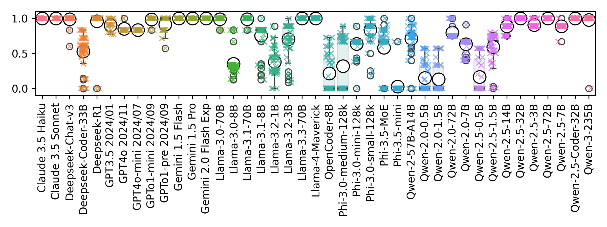 | RdfConnectionExplainStatic, graphFormat=jsonld: listTrimF1 score |
| 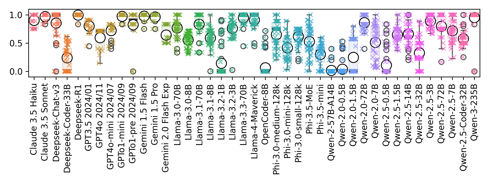     | RdfConnectionExplainStatic, graphFormat=nt: listTrimF1 score     |
| 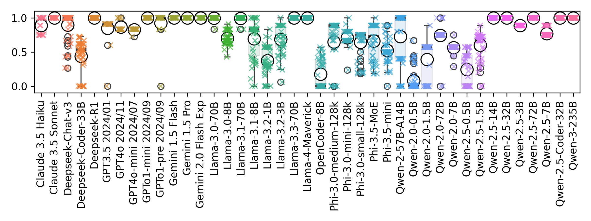 | RdfConnectionExplainStatic, graphFormat=turtle: listTrimF1 score |
| 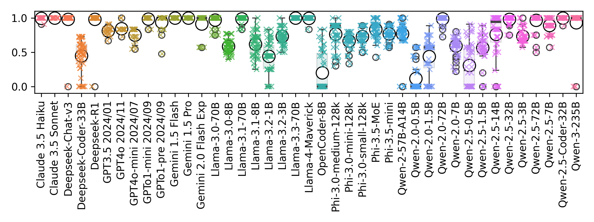    | RdfConnectionExplainStatic, graphFormat=xml: listTrimF1 score    |

### RDF Friend Count Tasks

| plot | caption |
|------------------------------------------| -----------------------------------------------------------------|
| 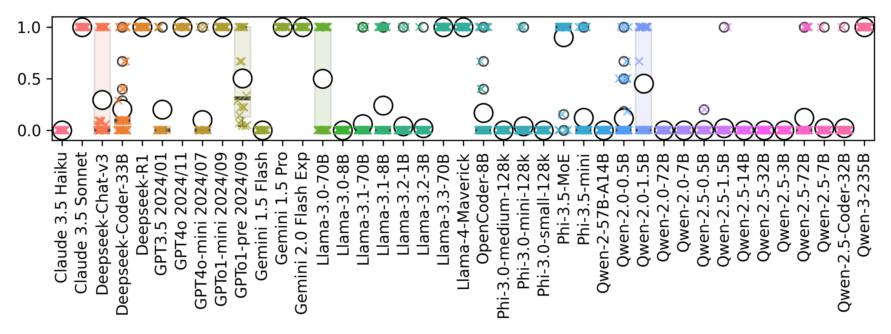 | RdfFriendCount, graphFormat=jsonld, 1 additional link: F1 score  |
| 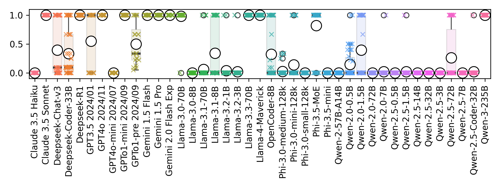 | RdfFriendCount, graphFormat=jsonld, 2 additional links: F1 score |
| 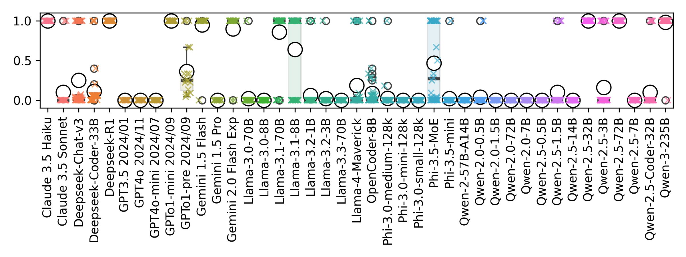     | RdfFriendCount, graphFormat=nt, 1 additional link: F1 score      |
| 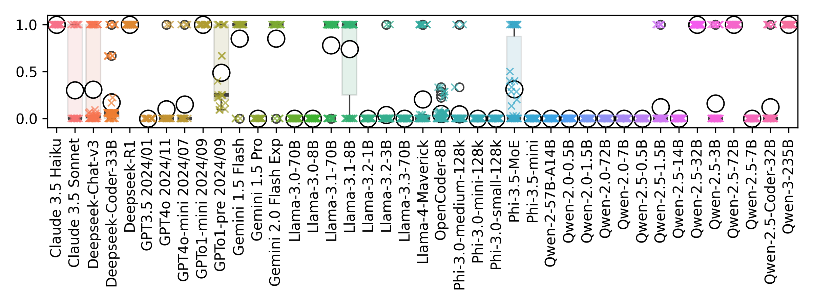     | RdfFriendCount, graphFormat=nt, 2 additional links: F1 score     |
| 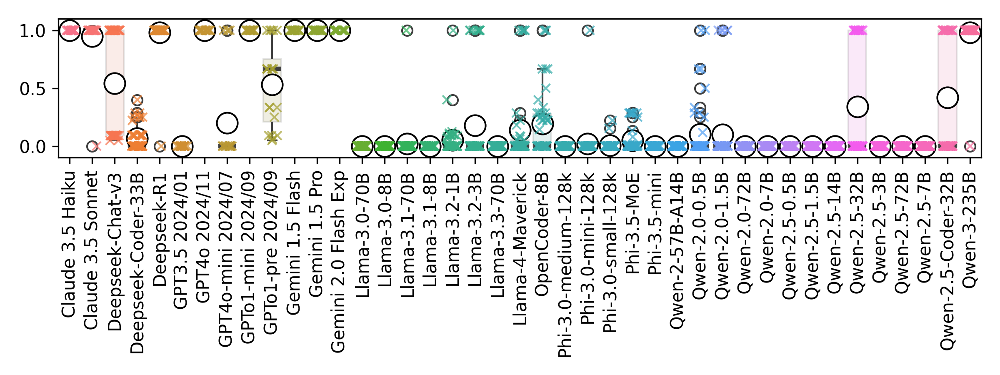 | RdfFriendCount, graphFormat=turtle, 1 additional link: F1 score  |
| 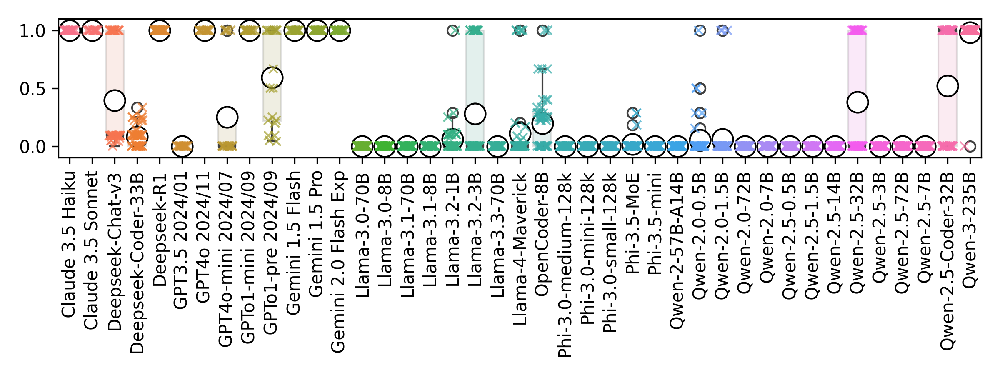 | RdfFriendCount, graphFormat=turtle, 2 additional links: F1 score |
| 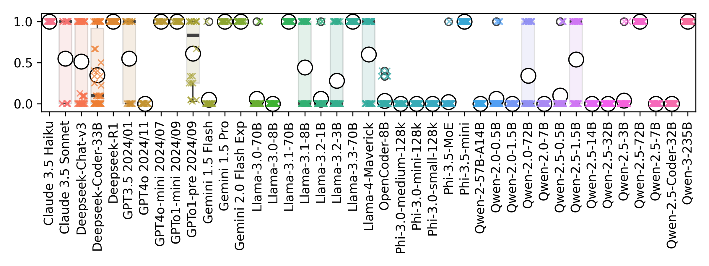    | RdfFriendCount, graphFormat=xml, 1 additional link: F1 score     |
| 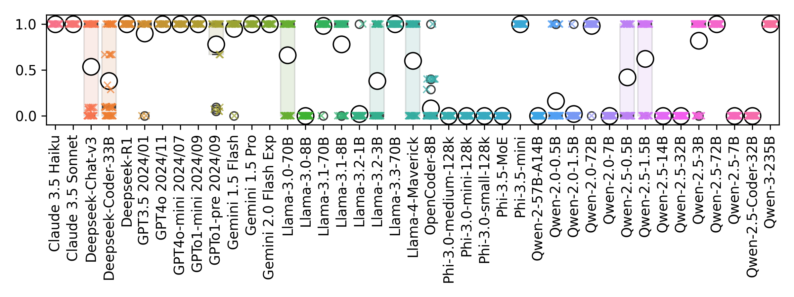    | RdfFriendCount, graphFormat=xml, 2 additional links: F1 score    |

### RDF Syntax Fix Tasks

| plot | caption |
|----------------------------------------------------| ---------------------------------------------------------|
| 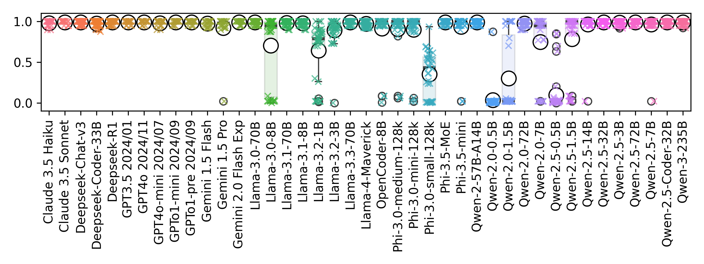 | RdfSyntaxFixList, graphFormat=jsonld: max(combined) score |
| 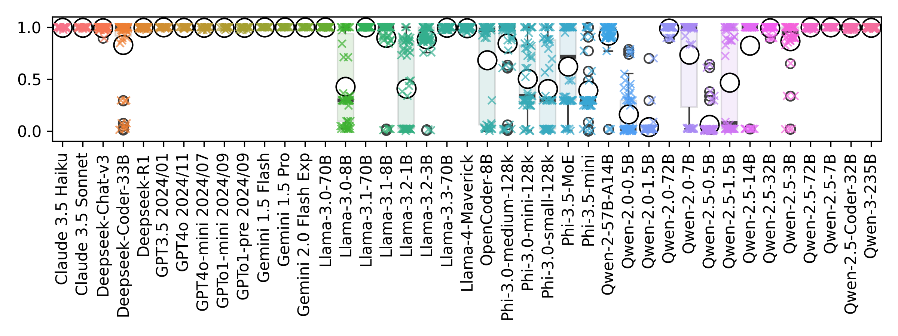     | RdfSyntaxFixList, graphFormat=nt: max(combined) score     |
| 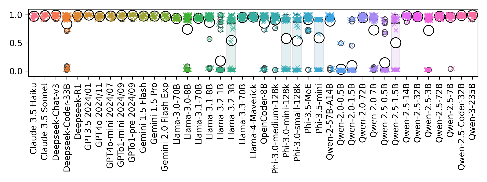 | RdfSyntaxFixList, graphFormat=turtle: max(combined) score |

### SPARQL Syntax Fix Task

| plot | caption |
|---------------------------------------------------------| -----------------------------------------------------------|
| 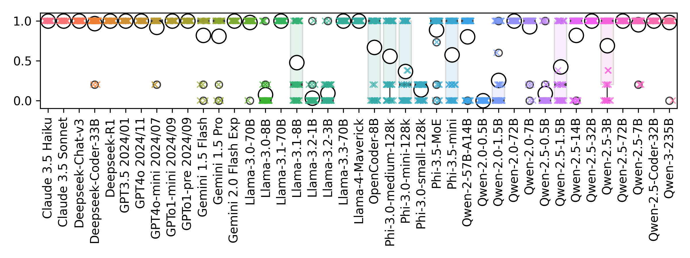 | SparqlSyntaxFixingList, dataset=LcQuad: max(combined) score |

### SPARQL to Answer Tasks

| plot | caption |
|-------------------------------------------------------| ----------------------------------------------------------------------------|
| 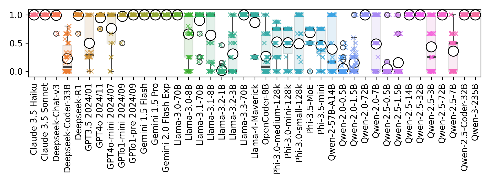 | Sparql2Answer, dataset=Organisational, graphFormat=jsonld: combinedF1 score |
| 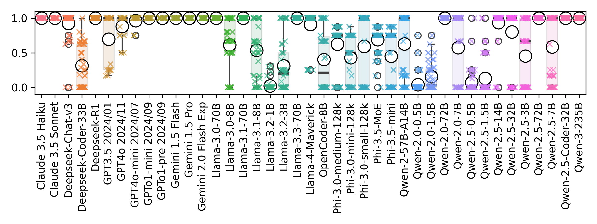 | Sparql2Answer, dataset=Organisational, graphFormat=turtle: combinedF1 score |

### Text to Answer Tasks

| plot | caption |
|-----------------------------------------------------| --------------------------------------------------------------------------|
| 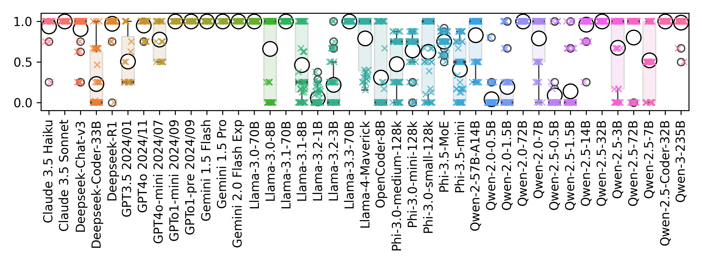 | Text2Answer, dataset=Organisational, graphFormat=jsonld: combinedF1 score |
| 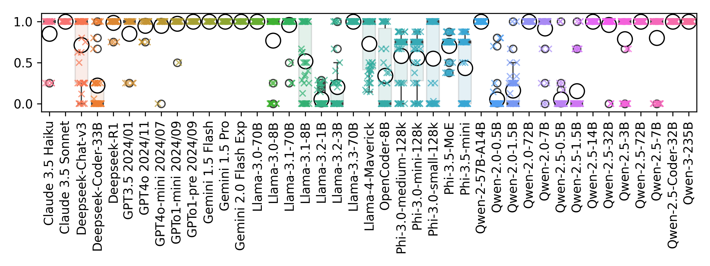 | Text2Answer, dataset=Organisational, graphFormat=turtle: combinedF1 score |

### Text to SPARQL Tasks

| plot | caption |
|------------------------------------------------------------------------------| ----------------------------------------------------------------------------------------------------|
| 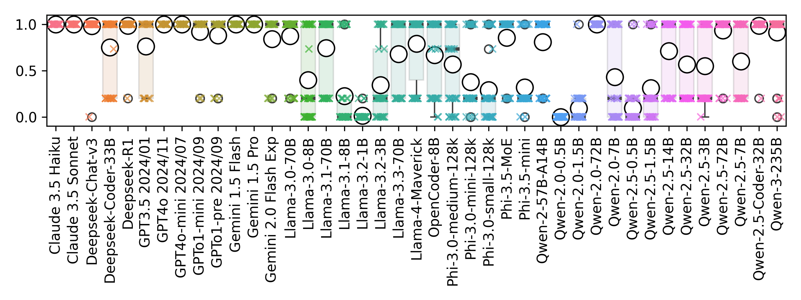             | Text2Sparql, dataset=Organizational, graphInfo=turtle graph: max(combined) score                    |
| 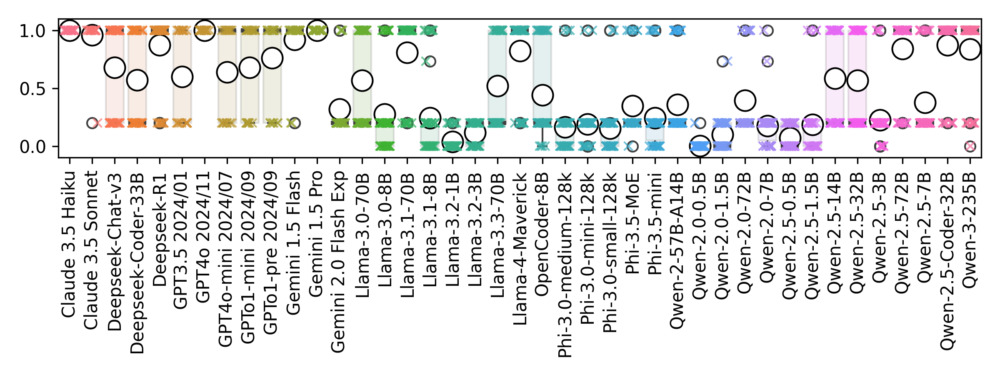              | Text2Sparql, dataset=Orga Numerical, graphInfo=turtle graph + ID-label-mapping: max(combined) score |
| 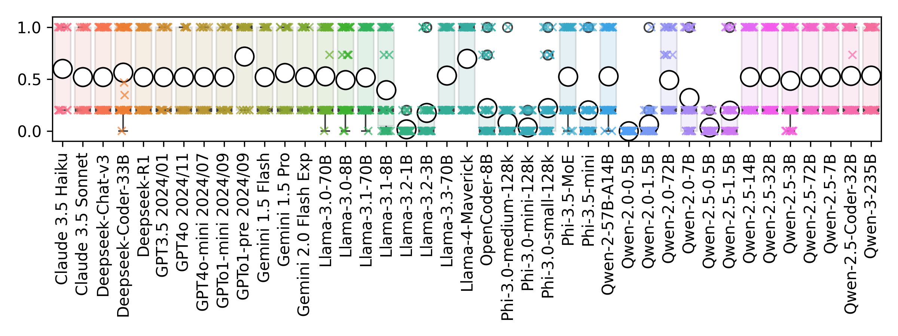                  | Text2Sparql, dataset=Coypu Mini, graphInfo=turtle graph: max(combined) score                        |
| 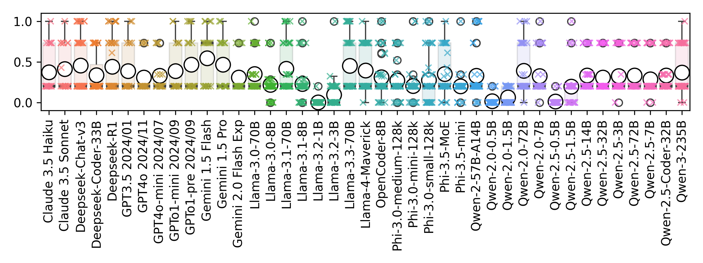    | Text2Sparql, dataset=Beastiary, graphInfo=turtle schema: max(combined) score                        |
| 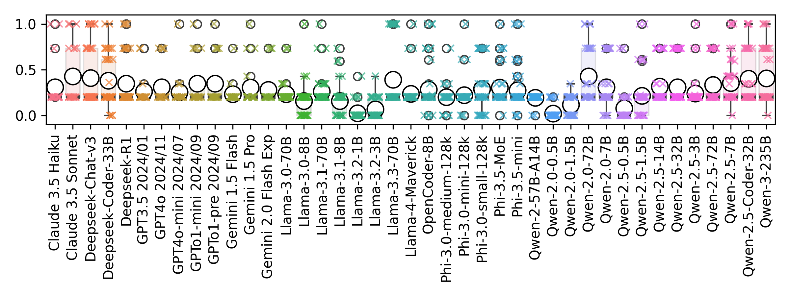 | Text2Sparql, dataset=Beastiary, graphInfo=turtle subschema: max(combined) score                     |
| 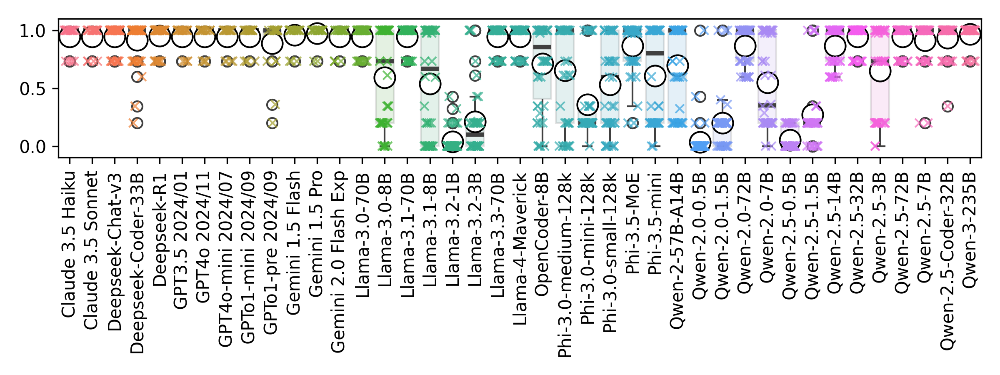  | Text2Sparql, dataset=Beastiary, graphInfo=turtle subgraph: max(combined) score                      |

## Model Preference Turtle vs. JSON-LD:
|                       | AllTasks | RdfConnectionExplainStatic | RdfFriendCount-1 | RdfFriendCount-2 | RdfSyntaxFixList | Sparql2AnswerListOrga | Text2AnswerListOrga |
| :-------------------- | :------- | :------------------------- | :--------------- | :--------------- | :--------------- | :-------------------- | :------------------ |
| All Models            | -        | -                          | **JSON**         | **JSON**         | **JSON**         | TTL                   | **TTL**             |
| Claude 3\.5 Haiku     | **TTL**  | **JSON**                   | **TTL**          | **TTL**          | -                | -                     | -                   |
| Claude 3\.5 Sonnet    | -        | -                          | -                | -                | -                | -                     | -                   |
| Deepseek-Chat-v3      | -        | **JSON**                   | **TTL**          | -                | -                | JSON                  | **JSON**            |
| Deepseek-Coder-33B    | JSON     | -                          | **JSON**         | **JSON**         | **JSON**         | -                     | -                   |
| Deepseek-R1           | -        | -                          | -                | -                | -                | -                     | -                   |
| GPT3\.5 2024/01       | -        | -                          | JSON             | **JSON**         | -                | -                     | **TTL**             |
| GPT4o 2024/11         | -        | -                          | -                | -                | JSON             | -                     | -                   |
| GPT4o-mini 2024/07    | **TTL**  | -                          | -                | TTL              | -                | -                     | **TTL**             |
| GPTo1-mini 2024/09    | -        | -                          | -                | -                | -                | -                     | -                   |
| GPTo1-pre 2024/09     | -        | -                          | -                | -                | -                | -                     | -                   |
| Gemini 1\.5 Flash     | **TTL**  | -                          | **TTL**          | -                | -                | -                     | -                   |
| Gemini 1\.5 Pro       | -        | -                          | -                | -                | -                | -                     | -                   |
| Gemini 2\.0 Flash Exp | -        | -                          | -                | -                | -                | -                     | -                   |
| Llama-3\.0-70B        | **JSON** | -                          | **JSON**         | **JSON**         | **JSON**         | -                     | -                   |
| Llama-3\.0-8B         | -        | **TTL**                    | -                | -                | -                | -                     | -                   |
| Llama-3\.1-70B        | -        | -                          | -                | -                | **JSON**         | **TTL**               | -                   |
| Llama-3\.1-8B         | **JSON** | -                          | **JSON**         | **JSON**         | JSON             | -                     | -                   |
| Llama-3\.2-1B         | **JSON** | -                          | -                | -                | **JSON**         | -                     | -                   |
| Llama-3\.2-3B         | -        | **JSON**                   | **TTL**          | **TTL**          | **JSON**         | -                     | -                   |
| Llama-3\.3-70B        | **JSON** | -                          | **JSON**         | **JSON**         | **JSON**         | -                     | -                   |
| Llama-4-Maverick      | **JSON** | -                          | **JSON**         | **JSON**         | -                | -                     | -                   |
| OpenCoder-8B          | -        | -                          | -                | -                | -                | TTL                   | -                   |
| Phi-3\.0-medium-128k  | **TTL**  | **TTL**                    | -                | JSON             | -                | -                     | TTL                 |
| Phi-3\.0-mini-128k    | -        | -                          | -                | **JSON**         | **JSON**         | -                     | -                   |
| Phi-3\.0-small-128k   | -        | **JSON**                   | -                | -                | TTL              | -                     | -                   |
| Phi-3\.5-MoE          | **JSON** | -                          | **JSON**         | **JSON**         | **JSON**         | **TTL**               | -                   |
| Phi-3\.5-mini         | -        | **TTL**                    | JSON             | -                | **JSON**         | **TTL**               | -                   |
| Qwen-2\.0-0.5B        | -        | -                          | -                | JSON             | -                | -                     | -                   |
| Qwen-2\.0-1.5B        | **JSON** | **TTL**                    | **JSON**         | **JSON**         | **JSON**         | -                     | -                   |
| Qwen-2\.0-57B-A14B    | TTL      | -                          | -                | -                | **JSON**         | TTL                   | **TTL**             |
| Qwen-2\.0-72B         | -        | -                          | -                | -                | **JSON**         | -                     | -                   |
| Qwen-2\.0-7B          | -        | **JSON**                   | -                | -                | -                | -                     | TTL                 |
| Qwen-2\.5-0.5B        | -        | -                          | -                | -                | -                | -                     | -                   |
| Qwen-2\.5-1.5B        | -        | -                          | -                | -                | **JSON**         | -                     | -                   |
| Qwen-2\.5-14B         | -        | **TTL**                    | -                | -                | -                | -                     | TTL                 |
| Qwen-2\.5-32B         | TTL      | -                          | **TTL**          | **TTL**          | **JSON**         | **JSON**              | -                   |
| Qwen-2\.5-3B          | -        | **JSON**                   | -                | -                | **JSON**         | -                     | -                   |
| Qwen-2\.5-72B         | -        | **JSON**                   | JSON             | **JSON**         | -                | -                     | **TTL**             |
| Qwen-2\.5-7B          | **TTL**  | **JSON**                   | -                | -                | -                | **TTL**               | **TTL**             |
| Qwen-2\.5-Coder-32B   | **TTL**  | -                          | **TTL**          | **TTL**          | -                | -                     | -                   |
| Qwen-3-235B           | -        | -                          | -                | -                | -                | -                     | -                   |

This table is available as [CSV file](allPreferences.csv) as well.